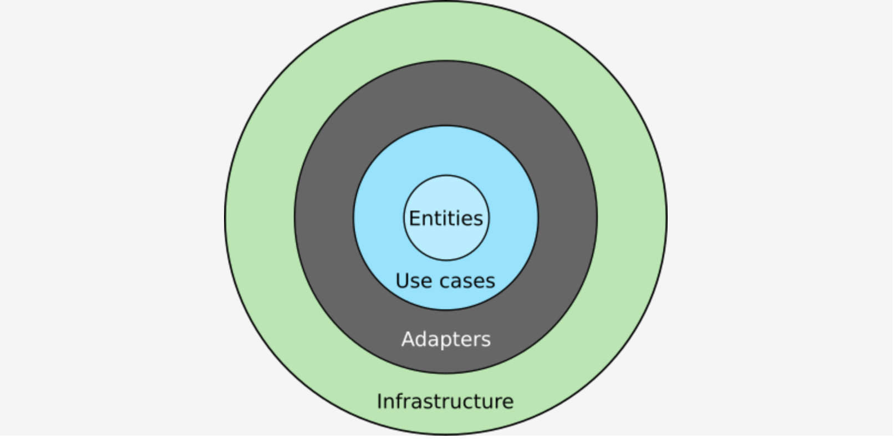

<p align="center">
    
</p>


# Clean Architecture

```
Reuse/Release Equivalence Principle (REP)
REP is a component level principle. Reuse refers to a group of reusable classes or modules. Release refers to publishing it with a version number. This principle says that whatever you release should be reusable as a cohesive unit. It shouldn't be a random collection of unrelated classes.

Common Closure Principle (CCP)
CCP is a component level principle. It says that components should be a collection of classes that change for same reason at the same time. If there are different reasons to change or the classes change at different rates, then the component should be split up. This is basically the same thing as the Single Responsibility Principle above.

Common Reuse Principle (CRP)
CRP is a component level principle. It says that you shouldn't depend on a component that has classes that you don't need. Those components should be split up so that the users don't have to depend on classes that they don't use. This is basically the same thing as Interface Segregation Principle above.


Acyclic Dependency Principle (ADP)
ADP means that you shouldn't have any dependency cycles in your project. For example, if component A depends on component B, and component B depends on component C, and component C depends on component A, then you have a dependency cycle.

Stable Dependency Principle (SDP)
This principle says that dependencies should be in the direction of stability. That is, less stable components should depend on more stable components. This minimizes the effect of change. Some components are intended to be volatile. That's OK, but you shouldn't make stable components depend on them.

Stable Abstraction Principle (SAP)
SAP says that the more stable a component is, the more abstract it should be, that is, the more abstract classes it should contain. Abstract classes are easier to extend so this keeps stable components from becoming too rigid.
```

## 용어 및 기술
- [Inject](https://github.com/ivankorobkov/python-inject)
- [dependency-injector](https://github.com/ets-labs/python-dependency-injector)
- [Term](https://pusher.com/tutorials/clean-architecture-introduction)


## Terminology
- Adapter: The adapters, also called interface adapters, are the translators between the domain and the infrastructure.
- Port: In application Layer, Port is an interface of Adapter.
- Boundary: In application Layer, Boundary is an interface of Presenter.
- Use Case: The use cases are the business rules for a specific application. 
- Infrastructure: This layer is where all the I/O components go: the UI, database, frameworks, devices, etc.
- Entity: An entity is a set of related business rules that are critical to the function of the application.


## Reference
- [The Clean Architecture in Python. How to write testable and flexible code](https://breadcrumbscollector.tech/the-clean-architecture-in-python-how-to-write-testable-and-flexible-code/)
- [Python으로 클린 아키텍처 적용하기](https://velog.io/@jahoy/Python%EC%9C%BC%EB%A1%9C-Clean-Architecture-%EC%A0%81%EC%9A%A9%ED%95%98%EA%B8%B0)
- [[Python] Django, Clean Architecture 연구하기](https://medium.com/@erish/python-django-clean-architecture-%EC%97%B0%EA%B5%AC%ED%95%98%EA%B8%B0-591d7a555059)
- [Clean architectures in Python: a step-by-step example](https://www.thedigitalcatonline.com/blog/2016/11/14/clean-architectures-in-python-a-step-by-step-example/)
